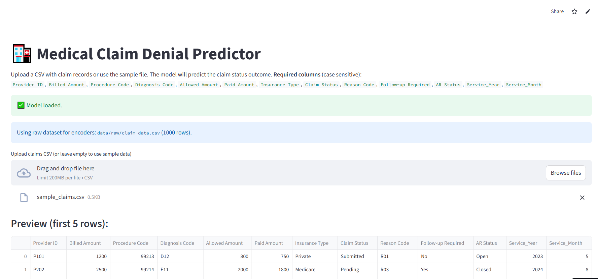
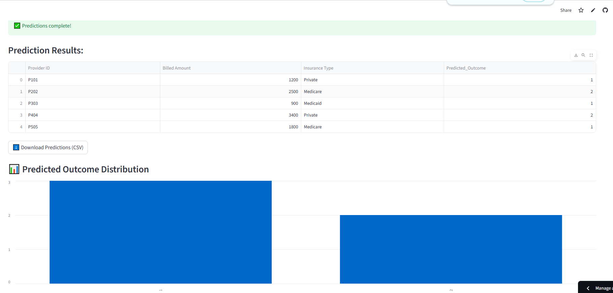

# 🏥 Medical Claim Denial Prediction

An end-to-end **Machine Learning project** built to predict the likelihood of a **medical claim being denied**, approved, or pending.
The project includes data preprocessing, model training, evaluation, comparison, and a **Streamlit web app** for live predictions.

---

## 📘 Project Overview

Medical claim denials are a major issue in healthcare administration. This project leverages machine learning to analyze claim data and predict outcomes automatically — helping hospitals and insurers identify risky claims early.

The project pipeline includes:

1. **Data Cleaning & Preprocessing**
2. **Feature Engineering**
3. **Model Training & Comparison** (Logistic Regression, Random Forest, Gradient Boosting)
4. **Best Model Selection & Saving**
5. **Streamlit Web App** for real-time prediction

---

## 🧠 Tech Stack

| Category            | Tools / Libraries                              |
| ------------------- | ---------------------------------------------- |
| **Language**        | Python 3.10                                    |
| **Libraries**       | Pandas, NumPy, Scikit-learn, Joblib, Streamlit |
| **Visualization**   | Matplotlib, Seaborn                            |
| **Deployment**      | Streamlit Cloud                                |
| **Version Control** | Git & GitHub                                   |

---

## 📂 Project Structure

```
Medical Claim Denial Prediction/
│
├── data/
│   ├── raw/claim_data.csv
│   ├── processed/claims_clean.csv
│   └── sample_claims.csv
│
├── models/
│   ├── best_model.pkl
│   └── claim_model.pkl
│
├── results/
│   └── predictions_output.csv
│
├── notebooks/
│   └── EDA_and_Modeling.ipynb
│
├── src/
│   ├── data_preprocessing.py
│   ├── model_train.py
│   ├── model_compare.py
│   ├── model_evaluation.py
│   └── model_predict.py
│
├── app.py
├── requirements.txt
└── README.md
```

---

## ⚙️ Installation & Setup

1. **Clone the Repository**

   ```bash
   git clone https://github.com/yourusername/medical-claim-denial-prediction.git
   cd medical-claim-denial-prediction
   ```

2. **Create a Virtual Environment**

   ```bash
   python -m venv .venv
   .venv\Scripts\activate   # On Windows
   source .venv/bin/activate  # On macOS/Linux
   ```

3. **Install Dependencies**

   ```bash
   pip install -r requirements.txt
   ```

4. **Run Model Training (if not done already)**

   ```bash
   python -m src.model_compare
   ```

5. **Launch the Streamlit App**

   ```bash
   streamlit run app.py
   ```

---

## 🌐 Deployed App

The live demo is hosted on **Streamlit Cloud**:
🔗 [https://medicalclaimdenialprediction-xl6jpo4akrhrevybzsfgbw.streamlit.app/](https://medicalclaimdenialprediction-xl6jpo4akrhrevybzsfgbw.streamlit.app/)

---

## 🖼️ Screenshots

### 🏠 App Home Interface



### 📊 Prediction Output



## 📊 Model Performance

| Model               | Accuracy | Notes                 |
| ------------------- | -------- | --------------------- |
| Logistic Regression | 0.31     | Baseline model        |
| Random Forest       | 0.36     | Moderate improvement  |
| Gradient Boosting   | **0.39** | Best performing model |

---

## 🧩 How the App Works

1. Upload a **CSV file** of medical claim data or use the sample file.
2. The trained model predicts the **claim outcome** for each record.
3. The app visualizes **predicted outcomes** using an interactive bar chart.

---


